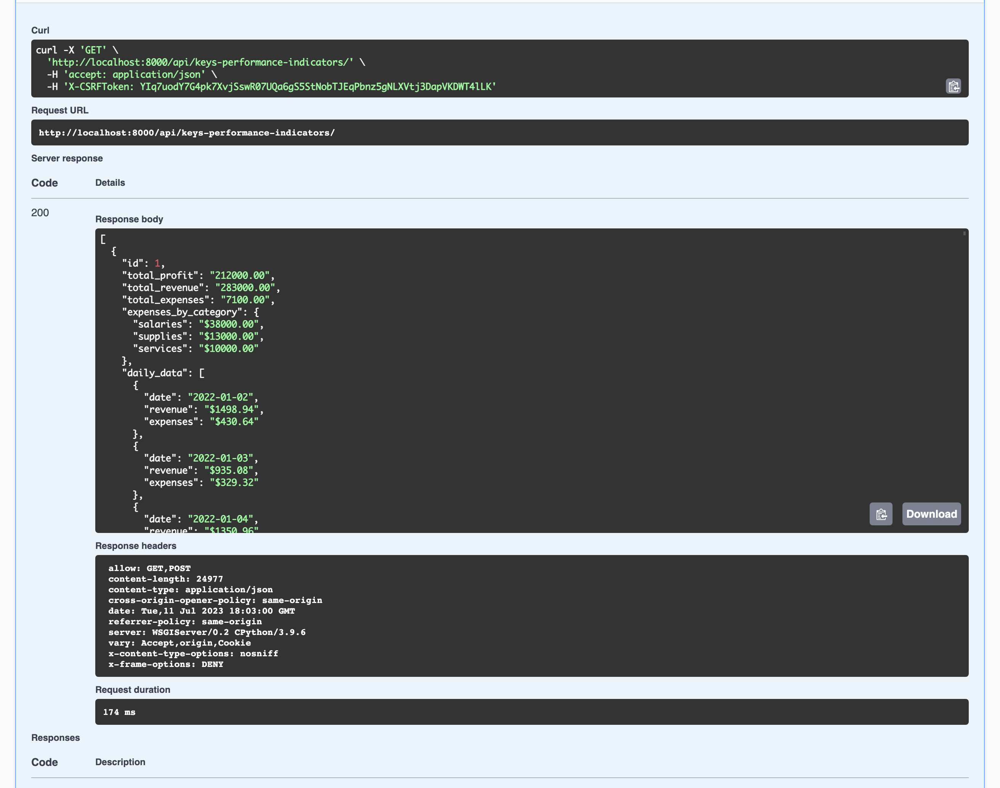

# Banky – Budget App
[](https://github.com/delitamakanda/banky/actions/workflows/django.yml)

Banky is a Django-powered budgeting and current-account API designed to help teams prototype financial workflows such as deposits, withdrawals, and balance limits. The project exposes a REST API backed by [Django REST Framework](https://www.django-rest-framework.org/) and includes auto-generated documentation via [drf-spectacular](https://drf-spectacular.readthedocs.io/).

## Table of contents
- [Features](#features)
- [Project structure](#project-structure)
- [Requirements](#requirements)
- [Quick start](#quick-start)
  - [1. Clone and configure the project](#1-clone-and-configure-the-project)
  - [2. Apply database migrations](#2-apply-database-migrations)
  - [3. Create an admin user](#3-create-an-admin-user)
  - [4. Launch the development server](#4-launch-the-development-server)
- [Running the tests](#running-the-tests)
- [API documentation](#api-documentation)
- [Management commands](#management-commands)
- [Static assets](#static-assets)

## Features
- Account lifecycle operations with strict limits on deposits, withdrawals, and aggregated balances.
- Server-side validation for invalid amounts, exceeded limits, and insufficient funds.
- Token, session, and basic authentication out of the box via Django REST Framework.
- Interactive API documentation powered by drf-spectacular (Swagger UI and ReDoc).
- Production-friendly defaults including WhiteNoise for static files, CORS headers, and security-focused settings sourced from environment variables.

## Project structure
```text
banky/
├── api/                  # REST API application (models, views, serializers, errors, custom commands)
├── config/               # Django settings, URL routing, and WSGI entrypoint
├── docs/                 # Design references and research notes
├── static/ & templates/  # Front-end assets served by Django
├── tests/                # Django test cases for the account domain
├── manage.py             # Django management utility
└── swagger_.png          # Screenshot of the generated Swagger UI
```

## Requirements
- Python 3.13 (see `runtime.txt`)
- `pip` 23.0+
- SQLite (bundled with Python) or another Django-supported database

All configuration values (e.g., `SECRET_KEY`, `DEBUG`, and `ALLOWED_HOSTS`) are loaded through [`python-decouple`](https://github.com/henriquebastos/python-decouple). Create a `.env` file at the project root or export the variables in your shell before running the application.

## Quick start

### 1. Clone and configure the project
```bash
# Clone the repository
$ git clone https://github.com/delitamakanda/banky.git
$ cd banky

# (Optional) create and activate a virtual environment
$ python3 -m venv .venv
$ source .venv/bin/activate

# Install dependencies
(.venv) $ python -m pip install --upgrade pip
(.venv) $ pip install -r requirements.txt
```

### 2. Apply database migrations
```bash
(.venv) $ python manage.py migrate
```

### 3. Create an admin user
You can create a superuser manually:
```bash
(.venv) $ python manage.py createsuperuser
```

Alternatively, run the bundled helper which generates credentials when none exist:
```bash
(.venv) $ python manage.py makesuperuser
```

### 4. Launch the development server
```bash
(.venv) $ python manage.py runserver
```
The site will be available at `http://127.0.0.1:8000/`.

## Running the tests
Use Django's test runner to execute the suite located in the `tests/` package:
```bash
(.venv) $ python manage.py test
```

## API documentation
Once the server is running you can explore the API contract through the automatically generated UIs:
- Swagger UI: [`/swagger/`](http://127.0.0.1:8000/swagger/)
- ReDoc: [`/redoc/`](http://127.0.0.1:8000/redoc/)
- Raw OpenAPI schema: [`/swagger/schema/`](http://127.0.0.1:8000/swagger/schema/)

A preview of the Swagger documentation is included below.



## Management commands
In addition to the default Django commands, the project ships with:
- `makesuperuser` – creates a superuser with a random password when none exist.

List the available commands with `python manage.py help`.

## Static assets
Static files are collected into `staticfiles/` via [WhiteNoise](http://whitenoise.evans.io/). To rebuild assets for deployment run:
```bash
(.venv) $ python manage.py collectstatic
```
This command is typically executed automatically by hosting providers such as Heroku or Render when deploying the application.
